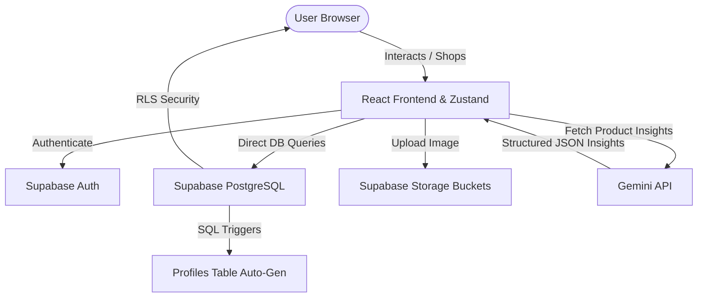

# 🛒 NexaShop

[](https://reactjs.org/)
[](https://www.typescriptlang.org/)
[](https://vitejs.dev/)
[](https://supabase.com/)
[](https://tailwindcss.com/)
[](https://opensource.org/licenses/MIT)

NexaShop is a next-generation, premium e-commerce storefront. It combines a stunning, modern glassmorphic frontend layout with a highly resilient serverless database layer powered by Supabase. NexaShop goes beyond standard shopping carts by incorporating an **AI-powered Product Insights Assistant** (powered by Google Gemini) and an interactive physics-based mascot (`NexaFox`) that follows cursor offsets in real-time.

---

## 📖 Table of Contents

- [Overview](#-overview)
- [Features](#-features)
- [Tech Stack](#%EF%B8%8F-tech-stack)
- [System Architecture](#-system-architecture)
- [Database Design](#-database-design)
- [Backend Infrastructure](#-backend-infrastructure)
- [Row Level Security (RLS) Policies](#-row-level-security-rls-policies)
- [Folder Structure](#-folder-structure)
- [Installation & Setup](#-installation--setup)
- [Environment Variables](#-environment-variables)
- [Usage Guide](#-usage-guide)
- [Screenshots](#-screenshots)
- [Future Enhancements](#-future-enhancements)
- [Deployment](#-deployment)
- [License](#-license)

---

## 🔍 Overview

NexaShop is a complete e-commerce solution built to demonstrate modern web practices. The application features a glassmorphic dashboard, responsive layout grids, and interactive Framer Motion animations. By connecting the frontend directly to Supabase, it leverages real-time updates, secure authentication, and complex serverless database triggers. 

Additionally, users can trigger the **Gemini AI Product Analyst** on any product page. This feature calls Gemini to compile a structured technical overview, detail pros/cons, output direct competitor models with pricing offsets, and issue a value-for-money recommendation.

---

## 🌟 Features

*   **Interactive 3D Mascot (`NexaFox`)**: Built using physics-based `framer-motion` springs, the mascot rotates and tracks the cursor offsets as the user interacts with the page.
*   **AI Product Insights Assistant**: Instant content generation using `gemini-2.5-flash` to analyze specifications, compare with competitors, list pros & cons, and render value recommendations.
*   **Authentication & Security**: Secure user registration, password encryption, and login sessions handled directly via Supabase Auth.
*   **Shopping Cart & Wishlist Store**: Global state stores managed with Zustand, offering local persistence and syncing with Supabase records.
*   **Address Management**: Integrated shipping details book allowing users to add, set default, or update shipping destinations.
*   **Checkout & Mock Payment**: Interactive invoice breakdowns including order subtotal, calculated taxes, delivery charges, and mock payment checks.
*   **Order Tracking Panel**: Detailed purchase histories showing transaction IDs, delivery updates (Pending, Processing, Shipped, Delivered), address logs, and date timestamps.
*   **PostgreSQL review Triggers**: Automatic averaging of ratings and update of total review counts on the database level using serverless SQL triggers.
*   **Protected Admin Console**: Separate admin interface allowing managers to add new items, update product inventories, manage categories, track orders, and update ship statuses.

---

## 🛠️ Tech Stack

### Frontend
*   **Core Framework**: React.js (v19)
*   **Language**: TypeScript
*   **Build Tool**: Vite
*   **Styling**: Tailwind CSS
*   **Animations**: Framer Motion (Mascot springs & transitions)
*   **Icons**: Lucide React
*   **State Management**: Zustand (Auth, Cart, and Wishlist states)
*   **Visual Effects**: Canvas Confetti (Checkout completions)

### Backend & Database
*   **Service Provider**: Supabase
*   **Database**: PostgreSQL
*   **Database Client**: Supabase JS SDK
*   **File Storage**: Supabase Storage Buckets
*   **Database Security**: Postgres Row Level Security (RLS)

### AI Core
*   **AI Engine**: Google Gemini API (`gemini-2.5-flash`)
*   **Features**: Spec analysis, competitor mapping, value verdict scoring

---

## 🏗️ System Architecture



---

## 🗄️ Database Design

The PostgreSQL database contains the following tables:

```
 profiles (linked to auth.users)
   ├── id (PK)
   ├── username (unique)
   ├── full_name
   ├── avatar_url
   └── role (customer / admin)

 categories
   ├── id (PK)
   ├── name
   ├── slug (unique)
   ├── image_url
   └── description

 products
   ├── id (PK)
   ├── name
   ├── description
   ├── price (numeric >= 0)
   ├── sale_price (numeric >= 0)
   ├── sku (unique)
   ├── stock_quantity
   ├── category_id (FK -> categories)
   ├── images (text[])
   ├── rating (0 - 5)
   ├── reviews_count
   ├── brand
   └── attributes (jsonb)

 cart_items
   ├── id (PK)
   ├── user_id (FK -> profiles)
   ├── product_id (FK -> products)
   └── quantity (integer > 0)

 wishlist
   ├── id (PK)
   ├── user_id (FK -> profiles)
   └── product_id (FK -> products)

 addresses
   ├── id (PK)
   ├── user_id (FK -> profiles)
   ├── title (e.g. Home, Office)
   ├── full_name
   ├── phone
   ├── street_address
   ├── city
   ├── state
   ├── postal_code
   └── country

 orders
   ├── id (PK)
   ├── user_id (FK -> profiles)
   ├── status (Pending, Processing, Packed, Shipped, Out For Delivery, Delivered, Cancelled)
   ├── total_amount
   ├── tax
   ├── delivery_charge
   ├── address_id (FK -> addresses)
   ├── payment_method
   └── payment_status

 order_items
   ├── id (PK)
   ├── order_id (FK -> orders)
   ├── product_id (FK -> products)
   ├── quantity
   └── price

 reviews
   ├── id (PK)
   ├── user_id (FK -> profiles)
   ├── product_id (FK -> products)
   ├── rating (1 - 5)
   └── comment
```

---

## ⚙️ Backend Infrastructure

1.  **Auth Integration & Profile Triggers**: When a user signs up through Supabase Auth, a Postgres trigger `on_auth_user_created` fires, running the security definer function `public.handle_new_user()` to automatically provision a customer record in the `profiles` table.
2.  **Reviews Auto-Averaging Trigger**: Rating statistics are maintained automatically. A database trigger `on_review_change` runs on reviews inserts, updates, and deletes, executing `public.handle_update_product_rating()` to recalculate and store the product's `rating` and `reviews_count`.
3.  **Role Verification Helper**: The function `public.is_admin()` checks if the calling user's UUID corresponds to a profile with the `'admin'` role, ensuring strict access control during admin database calls.

---

## 🛡️ Row Level Security (RLS) Policies

All tables have RLS enabled to prevent unauthorized data manipulation:

*   **Profiles**: Public profiles are read-only for select queries. Updates are only permitted if `auth.uid() = id` (the profile owner) or by users verified as admins via `public.is_admin()`.
*   **Products & Categories**: Viewable publicly (`SELECT` allowed to all). Insertions, edits, and deletions require `public.is_admin()` to return `true`.
*   **Carts, Wishlists, & Addresses**: Selecting, inserting, updating, or deleting records is strictly limited to the authenticated user owning the record (`auth.uid() = user_id`).
*   **Orders & Order Items**: Viewable and manageable by the authenticated owner. Admins also hold full access rights to edit ship statuses.

---

## 📁 Folder Structure

```
nexashop/
├── public/                     # Favicons & static assets
├── scripts/                    # Database seeds & connection verification scripts
├── src/
│   ├── assets/                 # SVGs and UI graphics
│   ├── components/
│   │   ├── layout/             # Header Navbar & Footer
│   │   └── shared/             # NexaFox mascot, ProductCards, ProtectedRoutes
│   ├── lib/
│   │   └── supabase.ts         # Supabase client instances
│   ├── pages/
│   │   ├── Admin/              # Inventories, categories, and order managers
│   │   ├── Auth/               # Login & sign-up portals
│   │   ├── Cart/               # Cart item control drawers
│   │   ├── Checkout/           # Addresses, invoice estimates, and mock payment
│   │   ├── Dashboard/          # Profile orders history tracking sheets
│   │   ├── Home/               # Interactive category banner & product grid
│   │   ├── ProductDetail/      # Product views, hover-zoom, review posts, and Gemini AI panels
│   │   └── Search/             # Brand lists, price sorting, and query results
│   ├── store/
│   │   ├── authStore.ts        # Zustand profile & session storage
│   │   ├── cartStore.ts        # Zustand cart controls
│   │   └── wishlistStore.ts    # Zustand wishlist items
│   ├── App.css                 # Custom scrollbars & overlay styles
│   ├── App.tsx                 # Routes mappings & switches
│   ├── index.css               # Tailwind CSS imports
│   └── main.tsx
├── supabase/
│   └── migrations/             # SQL setup schema & triggers
├── tailwind.config.js          # Tailwind styling configs
└── vite.config.ts              # Vite plugins & proxy settings
```

---

## 🚀 Installation & Setup

1.  **Clone the Repository**:
    ```bash
    git clone <repository-url>
    cd nexashop
    ```

2.  **Install Dependencies**:
    ```bash
    npm install
    ```

3.  **Run Database Migrations**:
    Apply the SQL schema inside your Supabase Project SQL Editor using the code in `supabase/migrations/20260619000000_init_schema.sql` or run:
    ```bash
    node scripts/apply-migrations.js
    ```

4.  **Start the Development Server**:
    ```bash
    npm run dev
    ```
    The application will run locally at `http://localhost:5173/`.

---

## 🔐 Environment Variables

Create a `.env` file in the root folder of the project:

```env
VITE_SUPABASE_URL=https://your-project-id.supabase.co
VITE_SUPABASE_ANON_KEY=your-supabase-anonymous-public-key
VITE_GEMINI_API_KEY=your-google-gemini-api-key
```

---

## 💻 Usage Guide

1.  **User Signup**: Register a new account on the `/auth` page. By default, new users are assigned the `customer` role.
2.  **Shopping Experience**: Browse products, search by model/brand, add items to your Wishlist, or add them to the Shopping Cart.
3.  **Addresses Book**: Enter your shipping credentials in the checkout panel or dashboard to persist default addresses.
4.  **Mock Invoice & checkout**: Proceed to checkout to review tax calculations, select shipping options, and complete mock payments with confetti visual feedback.
5.  **AI Analysis Panel**: On any product page, click the **AI Insights** button. Provide your Google Gemini API key (or use the backend variable) to instantly generate spec summaries, pros/cons list, price comparisons, and recommendations.
6.  **Administrator Access**: Log in with administrator credentials (e.g. `admin@nexashop.com` / `AdminSecure2026!`) to open the **Admin Console**. In the console, you can insert products, create categories, manage stocks, and update customer order status values.

---

## 📸 Screenshots

 **Catalog Dashboard**  
 |
| **Product detail** | 
 |
| **AI Insights Panel** | 
 |
| **Cart & checkout** | 
 |
| **Dashboard History** | 
 |


---

## 🔮 Future Enhancements

*   **Payment Gateways**: Integrate Stripe or PayPal API endpoints for processing actual transactions.
*   **Search Optimization**: Implement Elasticsearch or PostgreSQL full-text search indexes for faster keyword matching.
*   **Real-time Stock Updates**: Subscribe to database modifications so that product stock decreases on the client instantly when other users check out.

---

## 📤 Deployment

The project can be deployed easily on **Vercel** or **Netlify**:

1.  Link your GitHub repository to Vercel/Netlify.
2.  Set the Build Command to `npm run build` and output directory to `dist`.
3.  Add environment variables: `VITE_SUPABASE_URL`, `VITE_SUPABASE_ANON_KEY`, and `VITE_GEMINI_API_KEY`.
4.  Click **Deploy**.

---

## 📄 License

This project is licensed under the MIT License. See the `LICENSE` file for details.
